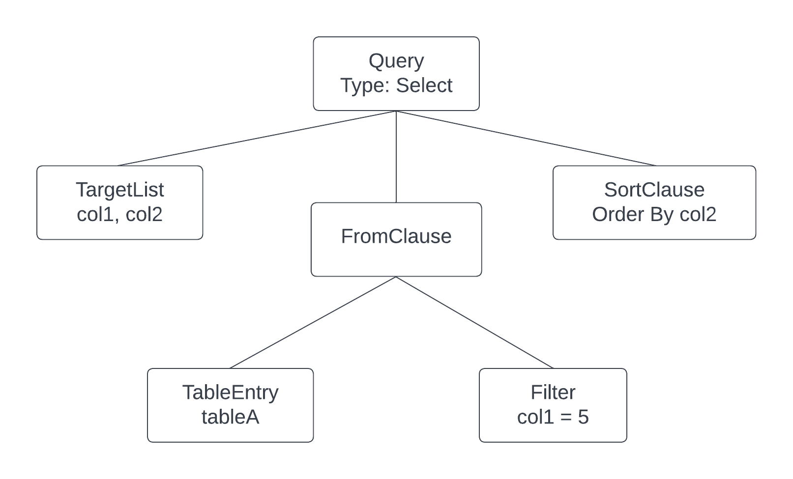

# Abstract Syntax Trees

Now that we have the basic building blocks of a SQL parser in place, it's time to start turning it into something useful. In this section we'll be making several config changes to the flex and bison tools, as well as introducing the concept of abstract syntax trees. I'll try to prune out the unnecessary info and instead provide links for further reading if you're interested.

An abstract syntax tree (AST) is a very powerful data structure that's often used in compilers. Typically, each node in the tree represents a rule defined in the grammar - though not every rule is represented by a node. Some rules exist only to inform the parser about things like precedence, groupings, etc.

The reason parsers produce ASTs is because it's relatively easy to write functions that walk the tree in order to perform its task. In a relational database, the parser AST is sent to the analyzer, which then walks the tree to perform semantic analysis. Basically, it's just checking that named references (tables, columns, etc.) actually exist in the database.

## Example SQL AST

Consider this SQL query:

```sql
Select col1, col2
From tableA
Where col1 = 5
Order By col2
```

The resulting AST from the parser might look something like this:



Any downstream process would walk through the tree by starting at the root node, a `Select` node, and traverse down through each branch to the leaf nodes. The tree-walker would need to know what child nodes to expect, but that's not a difficult thing to do.

## Goals

If you remember from the previous section, we built a parser that is able to recognize three commands: `insert`, `select`, and `quit`. Our goal for this section is to refactor the parser to return an AST to the caller, and actually implement the `quit` command.

Refactoring will involve changing some flex and bison config options that I won't delve very deep into. We're also going to change the `quit` syntax from the word "quit" into `\q` - the same command postgres' `psql` utility uses. This is an important change because it lays the foundation for implementing other system commands we might want later down the road. We'll be telling our parser that command beginning with a backslash should be treated as a system command.