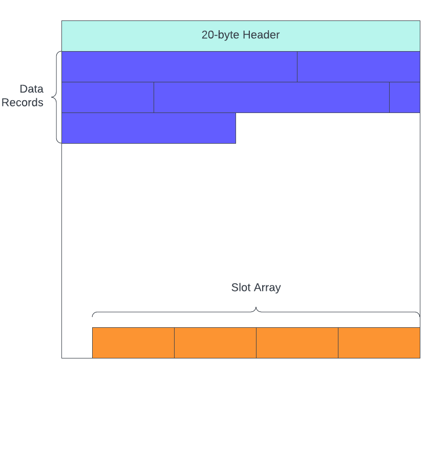

# The Database Page

In this section I am going to introduce and discuss the concept of a database "page". I won't be writing any code, so if that's all you're interested in, I suggest you skip to the next section.

TODO: Add more diagrams, especially for the Record Structure section.

## Data File

Databases store data in files on disk. They aren't doing any magic voodoo behind the scenes (although they're so clever it kind of seems like magic), it's just reading and writing data to regular files. Some of the magic comes in to play with how the storage engine organizes data in those files.

Not all RDBMS platforms implement storage in the same way. Some (e.g. postgres) use hundreds of different files - you create a new table, you get a new set of files just for that table. Others (e.g. Microsoft SQL Server) use far fewer files - in its default setup, you get two files. One for the data and one for the transaction log.

The system we're building is going to be similar to MS SQL Server - one file for the data, and one for the transaction log.. if I ever get around to implementing it. Moreover, the structure of our data pages will not align with any existing RDBMS out there. Instead I'm using a combination of MS SQL Server and Postgres - taking the things I like about both and ignoring what I don't like.

## Data Page

Within the data files, the storage engine organizes the data into uniformly-sized chunks - typically 8kB. The is the most basic unit that database systems work with. If you ask the DB to return a single row from a table, it first has to read an entire 8kB page into memory, then it can scan the page for the record you requested.

So we have 8kB pages, how are they structured?



### Page Header

You can think of a data page as being composed of three sections. The first is the page header, which contains metadata about itself. The size and type of information stored in a page header differ from system to system. In our system, we will be working with pages that have 20-byte headers.

The header fields are as follows:

| Header Field | Size | Description |
| ------------ | ---- | ----------- |
| pageId | 4-bytes | One-based page identifier. Used to mark the byte position of the page in the file. |
| pageType | 1-byte | Identifies the type of page. 0 = data page, 1 = index page |
| indexLevel | 1-byte | Level of the page in an index. 0 = leaf level (or heap page) |
| prevPageId | 4-bytes | Points to the previous page at the same `indexLevel`. If there is no previous page, then its value is 0. |
| nextPageId | 4-bytes | Points to the next page at the same `indexLevel`. If there is no next page, then its value is 0. |
| numRecords | 2-bytes | Number of records stored on the page |
| freeBytes | 2-bytes | Number of unclaimed bytes on the page |
| freeData | 2-bytes | Number of continuous free bytes between the end of the last record and the beginning of the slot array |

**pageId**

The `pageId`'s purpose is to tell the storage engine where it belongs within the data file. In a database with 8kB pages, we know that `pageId=1` belongs at the beginning of the file. `pageId=3` belongs at byte offset (3-1) * 8192 = 16,384 in the file.

The first thing that probably popped out at you is the `pageId` being a one-based identifier instead of zero-based. That's because we need to reserve zero as "nothing" for the `prevPageId` and `nextPageId` header fields. The "nothing" indicating there is not prev or next page.

**pageType and indexLevel**

These fields will be important when we implement indexes. But it does serve an important purpose for the query engine. The data stored on index pages looks a lot different than the data stored on data pages, so the query engine needs to know which type of data it's dealing with.

**prevPageId and nextPageId**

Database pages exist as part of a doubly-linked list, and these two fields serve as the pointers in the list. Since we're using a single file for the data in our database, we have to store the data for multiple different tables in the same file. This means the data for `tableA` will not be a contiguous chunk of the file - it will have pages from `tableB` interspersed. These prev and next pointers help the query engine efficiently scan the file for the data it cares about.

**numRecords**

Exactly as the name suggests, it stores the number of records on the page. This field won't be very useful in the near term, but it will help us later on when we decide to store statistics about the tables in our database.

**freeBytes and freeData**

These two will often have the same value, but they serve two different roles. The former is used to determine if the storage engine can reorganize and compact the existing data records to make room for a new one. The latter is used to determine if a new record can fit on the page or not.

In a typical transactional database, we have lots of inserts, updates, and deletes happening all the time. Let's say we have a data page that's completely full and a user wants to delete a record in the middle of the page. The storage engine will mark it as deleted, but it WILL NOT reorganize the existing records towards the beginning of the page. Instead, there will be a hole of empty space in the middle.

Because the empty space is in the middle of the page, when a new insert comes along the storage engine will still consider this page full because the value stored in `freeData` is not large enough. However, `freeBytes` IS large enough, so the storage engine might decide now is a good time to compact the existing records on the page in order to make room at the end of the page for the new one.

### Slot Array

Growing from the end of the page towards the beginning, each slot array item consumes 4-bytes and stores two pieces of information:

- A byte offset from the beginning of the page to the beginning of its corresponding data record
- The byte length of the data record

The slot array is also responsible for maintaining the order of records stored on the page. This is not as significant in a heap as it is in an index; however, it's important to understand that the records themselves ARE NOT physically stored in any particular order. The slot array is what determines the sort order of data records on the page.

The slot array grows from the end of the page towards the beginning. For each new record inserted on the page, the data itself is **appended** to the end of the last record on the page, and a new slot array item is **prepended** to the beginning of the slot array. This means in order for a page to have enough space for the new record, it must have enough empty space for the record itself AND space for the new slot array entry.

### Record Structure

Data records are added to the page starting at the end of the header and growing towards the end of the page.

Much like data pages, data records also have a fixed-length header that stores certain metadata about the record. The header fields we use in this project are most similar to postgres because the way we handle transaction isolation will be like postgres. In fact, we won't even use most of these fields for a while, but building them in right now so we don't have to do as much refactoring in the future. The record header is a fixed 12 bytes long with the following fields:

| Header Field | Size | Description |
| ------------ | ---- | ----------- |
| xmin | 4-bytes | Transaction Id that inserted the record |
| xmax | 4-bytes | Transaction Id that deleted the record |
| infomask | 2-bytes | Bit fields containing meta-information about record, e.g. if the row has Nullable columns or variable-length columns. |
| nullOffset | 2-bytes | The byte-offset from the beginning of the record to the start of the Null bitmap |

`xmin`, `xmax`, and some of the bit fields in `infomask` won't be used until we implement transaction isolation.

#### Record Data Layout

After the header, the columns in the record are organized in a particular manner. To demonstrate this, we'll use the following table definition as an example:

```sql
Create Table person (
    person_id Int Not Null,
    first_name Varchar(20) Null,
    last_name Varchar(20) Not Null,
    age Int Null
);
```

This table has both fixed-length (`Int`) and variable-length (`Varchar`) columns, as well as nullable columns. After the record header, the storage engine stores data in the following order:

1. Fixed-length columns
1. Null bitmap (iff the table has Nullable columns)
1. Variable-length columns (if any)

So if we inserted data like this:

```sql
Insert Into person ( person_id, first_name, last_name, age )
Values
(1, Null, 'burke', 30);
```

At a high level, the engine would store the data on disk like so:

```
| <record_header> | 1 | 30 | <null_bitmap> | burke |
```

Notice the two fixed-length columns come first, sorted in the order they were defined in the `Create Table` statement, then the Null bitmap, and finally the variable-length columns. However, since `first_name` is Null, the storage engine does not need to store anything for it in the variable-length portion of the record because the Null bitmap will let the engine know that it's Null.

#### Variable-Length Offsets

The last thing we need to cover is the storage overhead associated with `Varchar` columns. Each non-null `Varchar` column has a corresponding 2-byte field storing the length of the data. These 2-byte fields are stored immediately before the `Varchar` value. If we zoom in on the data shown above:

```
| ... | <null_bitmap> | 7-burke |
```

It's a little wonky to represent it like this. But, we store `7` to represent the entire length of the `Varchar` column: 2-bytes for the overhead + 5-bytes for the data (1-byte per character).