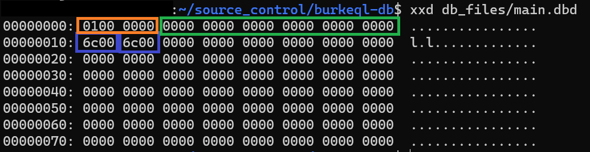

# DB Page Implementation

Before we write the code that implements our `Page` API, we need to add a new global config parameter that tells the DB engine how many bytes a data page consumes.

I'm going to start with an absurdly small value: 128 bytes. Add this to the `burkeql.conf` file:

```conf
# Byte size of a data page
PAGE_SIZE=128
```

Next, we need to update the `config.h` header file to inform it of our new config parameter:

```diff
 typedef enum ConfigParameter {
   CONF_DATA_FILE,
+  CONF_PAGE_SIZE,
   CONF_UNRECOGNIZED
 } ConfigParameter;
 
 typedef struct Config {
   char* dataFile;
+  int pageSize;
 } Config;
```

And finally, we need to make the associated updates to our functions in `config.c`:

```diff
 void print_config(Config* conf) {
   printf("======   BurkeQL Config   ======\n");
   printf("= DATA_FILE: %s\n", conf->dataFile);
+  printf("= PAGE_SIZE: %d\n", conf->pageSize);
 }
 
 static ConfigParameter parse_config_param(char* p) {
   if (strcmp(p, "DATA_FILE") == 0) return CONF_DATA_FILE;
+  if (strcmp(p, "PAGE_SIZE") == 0) return CONF_PAGE_SIZE;
 
   return CONF_UNRECOGNIZED;
 }
 
 static void set_config_value(Config* conf, ConfigParameter p, char* v) {
   switch (p) {
     case CONF_DATA_FILE:
       v[strcspn(v, "\r\n")] = 0; // remove trailing newline character if it exists
       conf->dataFile = strdup(v);
       break;
+    case CONF_PAGE_SIZE:
+      conf->pageSize = atoi(v);
+      break;
   }
 }
```

## Page API

Using the header file we wrote in the previous section, let's dive straight into the code. First, the easy ones: allocating and freeing the page block:

```c
extern Config* conf;

Page new_page() {
  Page pg = malloc(conf->pageSize);
  memset(pg, 0, conf->pageSize);
  return pg;
}

void free_page(Page pg) {
  if (pg != NULL) free(pg);
}
```

It's about as straightforward as you can get. We simply allocate enough memory for a fixed-size data page and return the pointer. And we pair it with a function that frees the memory.

Now let's read a page block from disk into a `Page` object:

```c
Page read_page(int fd, uint32_t pageId) {
  Page pg = new_page();
  lseek(fd, (pageId - 1) * conf->pageSize, SEEK_SET);
  int bytes_read = read(fd, pg, conf->pageSize);

  if (bytes_read != conf->pageSize) {
    printf("Bytes read: %d\n", bytes_read);
    PageHeader* pgHdr = (PageHeader*)pg;
    /* Since this is a brand new page, we need to set the header fields appropriately */
    pgHdr->pageId = pageId;
    pgHdr->freeBytes = conf->pageSize - sizeof(PageHeader);
    pgHdr->freeData = conf->pageSize - sizeof(PageHeader);
  }

  return pg;
}
```

Our function takes two inputs: a file descriptor and a `pageId`. This implies the caller will already have an open file, and it knows exactly which page block it wants to pull from disk.

First, we need to allocate memory as a landing spot for the data we intend to pull from disk. Then we tell the file pointer to move to offset `(pageId - 1) * conf->pageSize` bytes from the beginning of the file (`SEEK_SET`). It's important to note that OUR `pageId`s are 1-based, but the math required to get the byte offset operates on 0-based pageIds.

Next we read `conf->pageSize` bytes into our `Page` memory block. The `read` function returns the number of bytes read from disk. If the value is not equal to the size of a page block, then there was an error, or the page does not exist in the file. If the page doesn't exist, then we need to set the `PageHeader` fields to values that represent a blank data page.

We're currently not using `pageType`, `indexLevel`, `prevPageId`, and `nextPageId` so we don't need to set any values. As for the rest, we do need to set some values. The `pageId` is pretty straightforward; the caller asked for a specific `pageId`, so we need to make sure that's what we return. `freeBytes` and `freeData` are always the same value for an empty page - just a count of empty bytes on the page. The page header is the only space being used, so we just subtract 20-bytes from the size of a full page. And the last field, `numRecords`, does not need to be explicitly set because it is already zero.

Next up, we need to write a function to flush data pages to disk.

```c
void flush_page(int fd, Page pg) {
  int pageId = ((PageHeader*)pg)->pageId;
  lseek(fd, (pageId - 1) * conf->pageSize, SEEK_SET);
  int bytes_written = write(fd, pg, conf->pageSize);

  if (bytes_written != conf->pageSize) {
    printf("Page flush unsuccessful\n");
  }
}
```

This one is comparatively a lot simpler. First we just need to extract the `pageId` from the header, then we tell the file pointer to move to the beginning of the spot where this page should be written. Then we `write` the page to disk.

The last piece is just an informational console log to tell us if something unexpected happened. We'll implement error handling later.

## Updating `main.c` and `Makefile`

Before we can demonstrate reading and writing pages to disk, we need to make some small updates to our main function and the Makefile.

`src/main.c`

```diff
 #include "global/config.h"
+#include "storage/file.h"
+#include "storage/page.h"
 
 Config* conf;
```

```diff
   print_config(conf);
 
+  FileDesc* fdesc = file_open(conf->dataFile);
+  Page pg = read_page(fdesc->fd, 1);
+
   while(true) {
     print_prompt();
```

At the very beginning of our program, we want to open the data file and attempt to read the first page into memory.

```diff
     switch (n->type) {
       case T_SysCmd:
         if (strcmp(((SysCmd*)n)->cmd, "quit") == 0) {
           print_node(n);
           free_node(n);
           printf("Shutting down...\n");
+          flush_page(fdesc->fd, pg);
+          free_page(pg);
+          file_close(fdesc);
           return EXIT_SUCCESS;
         }
       default:
```

When the database receives the quit command, we want to flush the data page that's currently in memory to disk, close the file, then shut down.

`src/Makefile`

```diff
 SRC_FILES = main.c \
 						parser/parse.c \
 						parser/parsetree.c \
 						global/config.c \
 						storage/file.c \
+ 						storage/page.c
```

## Running the Program

Now we can compile and run our program to test out these changes.

```shell
$ ./burkeql
======   BurkeQL Config   ======
= DATA_FILE: /home/burke/source_control/burkeql-db/db_files/main.dbd
= PAGE_SIZE: 128
bql > \quit
======  Node  ======
=  Type: SysCmd
=  Cmd: quit
Shutting down...
$
```

We didn't change anything with the parser, so the interesting stuff doesn't happen here. We just needed to run and quit the program so that it would write a page to our data file for us. Let's take a look at its contents:



Using the `xxd` command, we can inspect the contents of our binary data file. `xxd [filename]` shows the hex representation of each byte in the file. Every pair of characters represents a single byte. The orange box I highlighted contains the 4-byte `pageId` header field, which we set to a value of 1 when we created the empty page.

Note: my machine is a Little-endian machine, which means it stores the "little-end" of a byte sequence first. As an example, say we have a two-byte (`uint16_t`) integer 38,924 represented in binary. As humans, we would show the binary value as:

`10011000 00011110`

This is the same as Big-endian in the machine world. A Little-endian machine would represent it in reverse order:

`00011110 10011000`

This is why we see the `pageId` field with the smallest byte first instead of `0000 0001` <-- hex representation.

Also, note that endian-ness only affects the order of bytes, it DOES NOT affect the order of the individual bits within the bytes.

The green box contains the 12-bytes of the header that are uninteresting to us right now. And the two blue boxes represent the 2-byte `freeBytes` and `freeData` fields. The "human readable" way to represent this hex value would be `0x006c`, which translates to 108 in decimal. And this is exactly what we want; the page is empty except for the 20-byte header, and we set the page size to 128 bytes in our config file, so there are 108 unused bytes on the page right now.

And that covers it. In the next section, we're going to update our lexer and parser to prepare for inserting data into our data page.