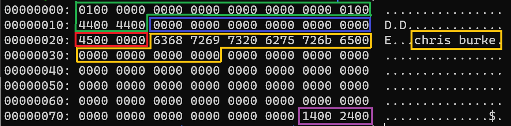
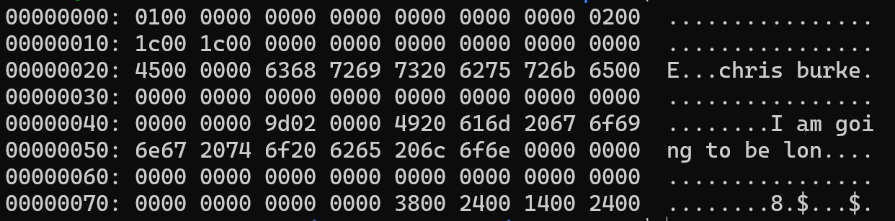

# Serializing Data

In this section, we are going to take the data from our insert statement and serialize it into a data Record that can then be inserted into the data page. The serializer needs to know a few things about our table/columns in order to process the data we give to it. Specifically, it needs to know how many columns are in the table and information about each column, such as the column's name, data type, its position in the record, and the byte-length.

As for the data, we need a convenient format to stuff our data into and pass it to the serializer - something that can take any kind of data type and trojan horse it into the serializer.

In order to do this, we're going to work with two new concepts: the `RecordDescriptor` and the `Datum`. These two concepts might not make a ton of sense right now, but they will be essential when we start working tables/columns that aren't hard-coded.

## RecordDescriptor

A `RecordDescriptor` is very appropriately named - it contains information that describes a table record. We'll use it to store information like the number of columns and a list of the columns with info about each one. Right now, our is actually quite simple:

`src/include/storage/record.h`

```c
typedef struct RecordDescriptor {
  int ncols;
  Column cols[];
} RecordDescriptor;
```

We have a property, `ncols`, that contains the number of columns stored in the data record. Currently, we're working with a hard-coded table definition that contains two columns.

There is also a flexible array member that contains a list of `Column` objects, which are defined as follows:

`src/include/storage/record.h`

```c
#pragma pack(push, 1) /* disabling memory alignment because I don't want to deal with it */
typedef struct Column {
  char* colname;
  DataType dataType;
  int colnum;     /* 0-based col index */
  int len;        /* byte-length of the column */
} Column;
```

You can think of this as a "ColumnDescriptor". We're storing some metadata about the column so that our serializer knows what to do with the data it receives.

`DataType` is an enum containing all supported data types by our database program:

`src/include/storage/record.h`

```c
typedef enum DataType {
  DT_INT,     /* 4-bytes, signed */
  DT_CHAR     /* Byte-size defined at table creation */
} DataType;
```

As we add support for more data types, we'll need to an entry in this enum.

## Datum

The singular form of the word "data," this is meant to be a super generic wrapper around any value that flows to and from a data page. We use something like a `Datum` so that we can stuff multiple different data types into an array when reading or writing column values from a data record.

Say we have a table with two columns, an `Int` and a `Char(20)`. It's much easier to convert each of them to a `Datum` before sending it through a serializer than it would be to write a million switch/case statements for all of the different supported data types in all of the intermediate functions between the client and the serializer. Instead, we only need to write one switch/case inside the serializer. Everything else just has to deal with a `Datum`.

Fortunately implementing this logic is pretty simple:

`src/include/storage/datum.h`

```c
typedef unsigned long Datum;

Datum int32GetDatum(int32_t i);
Datum charGetDatum(char* c);

int32_t datumGetInt32(Datum d);
char* datumGetString(Datum d);
```

We define a `Datum` as an `unsigned long`, and a pair of conversion functions for each data type we support. Right now we support the `Int` and `Char` database data types, so we need a function to convert them from their C-types to the `Datum`, and another to convert from the `Datum` back to the C-type.

And those functions could not be simpler, we're simply casting pointers back and forth:

`src/storage/datum.c`

```c
Datum int32GetDatum(int32_t i) {
  return (Datum) i;
}

Datum charGetDatum(char* c) {
  return (Datum) c;
}


int32_t datumGetInt32(Datum d) {
  return (int32_t) d;
}

char* datumGetString(Datum d) {
  return (char*) d;
}
```

## record.h

Before we move on to the serializing section, I want to round out the `record.h` header file.

Similar to the `Page` type we created earlier, we're going to create a generic `Record` type that's an alias for a `char*`:

`src/include/storage/record.h`

```c
typedef char* Record;
```

We're also going to expose a few functions that will be mainstays in our database program.

```c
Record record_init(uint16_t recordLen);
void free_record(Record r);

void free_record_desc(RecordDescriptor* rd);

void construct_column_desc(Column* col, char* colname, DataType type, int colnum, int len);

void fill_record(RecordDescriptor* rd, Record r, Datum* data);
```

`record_init` and `free_record` are your basic allocator/free pair of functions.

`free_record_desc`. You're probably wondering why there's not allocator function to go with this one. It's because the allocator needs to have hard-coded values at this point, so it's going to be in `main.c` for now.

`construct_column_desc` is just a way to populate a `Column` object with the necessary metadata.

`fill_record` is the main serializer function. It takes your `Datum` array and serializes each column value according to the information it finds in the `RecordDescriptor`.

## Serializing and Inserting Data

Quick warning before we get into the code. You might be confused by the way I'm organizing the code here - some of it is throwaway code I'm sticking in the `main.c` file knowing it'll be refactored or wholesale rewritten later, and other pieces serve as groundwork for the more permanent code. So if you find yourself asking "why is this function here instead of in <filename>?", just bear with me for a while. It'll be more organized down the road.

Okay, so how do we use `RecordDescriptor`s and `Datum`s to turn our data into a table record? First, let's list the steps we need to take:

1. Construct a `RecordDescriptor` for the table we want to insert our data into.
1. Allocate a block of memory with the exact amount of space our data record needs. This is the landing zone for the serialized data.
1. Allocate memory for a `Datum` array and fill it by converting our input data into `Datum`s.
1. Serialize
1. Insert

### Constructing a RecordDescriptor

Since we're working with a hard-coded table, we can hard-code the contents of a `RecordDescriptor`:

`src/main.c`

```c
static RecordDescriptor* construct_record_descriptor() {
  RecordDescriptor* rd = malloc(sizeof(RecordDescriptor) + (2 * sizeof(Column)));
  rd->ncols = 2;

  construct_column_desc(&rd->cols[0], "person_id", DT_INT, 0, 4);
  construct_column_desc(&rd->cols[1], "name", DT_CHAR, 1, 20);

  return rd;
}
```

We start by allocating memory for the `RecordDescriptor` object. We are taking advantage of C's flexible array member pattern here. The struct definition includes a `Column` array without a defined size, which means we get to define its size at the same time we `malloc` the parent object. Everything after `sizeof(RecordDescriptor)` will be part of the `Column` array.

The rest of the function is where we hard-code the table definition. We know there are two columns. We know `person_id` is a `DT_INT`, the 0th column, and consumes 4 bytes. Similarly, we know `name` is a `DT_CHAR`, the 1st column, and consumes 20 bytes.

Note: since the `RecordDescriptor` contains a `Column` array, NOT a `Column*`, we need to `&` the item in the array in order to pass the pointer to the function.

`src/storage/record/c`

```c
void free_record_desc(RecordDescriptor* rd) {
  for (int i = 0; i < rd->ncols; i++) {
    if (rd->cols[i].colname != NULL) {
      free(rd->cols[i].colname);
    }
  }
  free(rd);
}

void construct_column_desc(Column* col, char* colname, DataType type, int colnum, int len) {
  col->colname = strdup(colname);
  col->dataType = type;
  col->colnum = colnum;
  col->len = len;
}
```

`free_record_desc` and `construct_column_desc` are a couple of those permanent functions that will stick with us until the end.

Of course we always need to pair the allocator function with a matching free function. We loop through the column array and free the `char*` pointers if they're present; however, we DO NOT free each array item. This is because they were allocated by the code used to allocate the `RecordDescriptor`. When we free the `RecordDescriptor`, we also free the `Column` array.

`construct_column_desc` is just a utility that sets the `Column` struct values.

### Allocate a Record

Next up, we need to allocate memory for the record. By the time our program gets to this point, it will have all the information it needs to determine the byte-length of the record it's going to serialize. So our allocator function asks for it as a function parameter:

`src/storage/record.c`

```c
Record record_init(uint16_t recordLen) {
  Record r = malloc(recordLen);
  memset(r, 0, recordLen);

  return r;
}

void free_record(Record r) {
  if (r != NULL) free(r);
}
```

Almost identical to the functions that allocate/free memory for a `Page`.

### The Datum Array and Serializing Data

We have a primary driver function for serializing data, called `serialize_data`. It is responsible for creating and populating the `Datum` array and serializing the data. It is another throwaway function, so the functionality lives in `main.c` for now.

`src/main.c`

```c
static void serialize_data(RecordDescriptor* rd, Record r, int32_t person_id, char* name) {
  Datum* data = malloc(rd->ncols * sizeof(Datum));
  populate_datum_array(data, person_id, name);
  fill_record(rd, r + sizeof(RecordHeader), data);
  free(data);
}
```

Pretty simple, just four lines that make calls to other functions performing the hard work. It takes a `RecordDescriptor` and `Record` as input, so by now the caller must have both of those objects ready to go.

`populate_datum_array` is yet another throwaway function that simply converts our data values to `Datum` types and stashes them in the array.

We'll cover `fill_record` below, but note the second input paramter. We're passing in `r + sizeof(RecordHeader)`. This function is going to copy our `Datum` data into the `Record` landing zone starting at the memory address we give it. Since we want the header data to stay as is, we need to give it the first writable address of that block of memory, hence `+ sizeof(RecordHeader)`.

`src/main.c`

```c
static void populate_datum_array(Datum* data, int32_t person_id, char* name) {
  data[0] = int32GetDatum(person_id);
  data[1] = charGetDatum(name);
}
```

Here we're simply converting `person_id` and `name` to `Datum` types and storing them in the array.

Next we have the meat and potatoes: `fill_record`. This function is where the serialization takes place.

`src/storage/record.c`

```c
void fill_record(RecordDescriptor* rd, Record r, Datum* data) {
  for (int i = 0; i < rd->ncols; i++) {
    Column* col = &rd->cols[i];

    fill_val(col, &r, data[i]);
  }
}
```

It's actually pretty simple. We just loop through the `RecordDescriptor`'s `Column` array and call `fill_val`. `fill_val` on the other hand can get quite gnarly. Notice the second parameter; we pass in the address of a pointer - remember `Record` is just a `char*`. Why is that necessary? I'll explain below.

`src/storage/record.c`

```c
static void fill_val(Column* col, char** dataP, Datum datum) {
  int16_t dataLen;
  char* data = *dataP;

  switch (col->dataType) {
    case DT_INT:
      dataLen = 4;
      int32_t valInt = datumGetInt32(datum);
      memcpy(data, &valInt, dataLen);
      break;
    case DT_CHAR:
      dataLen = col->len;
      char* str = strdup(datumGetString(datum));
      int charLen = strlen(str);
      if (charLen > dataLen) charLen = dataLen;
      memcpy(data, str, charLen);
      free(str);
      break;
  }

  data += dataLen;
  *dataP = data;
}
```

This is where we actually do the serializing. The interesting bit is handled in the `switch` block where we perform data type specific actions to deposit our raw data into the `Record` landing zone. But first, a note about the `char** dataP` parameter and the second line of the function: `char* data = *dataP`.

Why do we pass in the memory address of a pointer, then immediately dereference it back to a pointer and store it in a different variable? In C, we pass parameters into functions **by value**, meaning if we take a pointer and perform some pointer arithmetic on it, e.g. `data += dataLen`, it will not persist when we return from the function. Sometimes we want that behavior, sometimes we don't. In this case, we definitely do not - we want the pointer arithmetic to persist.

The obvious question then becomes "why do we want the pointer arithmetic to stick?" Because we call `fill_val` in a loop. Each iteration writes some data to the `Record` memory block and after we write something, we want to move the pointer to the next writable address. In our case, we first write the 4-byte `person_id` int to the `Record`. Now we want to move the pointer by 4 bytes so that the next call to `fill_val` doesn't overwrite our `person_id` data.

Anyways, back to the serializer function. In the switch block we convert our `Datum` value back to its C-type, according to the info in the `Column` descriptor. Then we `memcpy` it into the `Record` landing zone. In the `DT_CHAR` case we have extra logic to truncate any strings that exceed the length defined in the `Column` descriptor. After that, we move the `Record` pointer forward by the number of bytes consumed by the data type.

It might look weird that we convert our `person_id` and `name` values from their C-types into `Datum`s, then back to their C-types before copying them into the `Record`. But, remember a `Datum` is just an easy way to have a singular data type such that we can have an array containing multiple different types of data.

### Inserting a Record

Now that the hard part is done, we get to tell our database to add the serialized `Record` to the data page. Our primary driver function (again, a throwaway piece of code):

`src/main.c`

```c
#define RECORD_LEN  36  // 12-byte header + 4-byte Int + 20-byte Char(20)

static bool insert_record(Page pg, int32_t person_id, char* name) {
  RecordDescriptor* rd = construct_record_descriptor();
  Record r = record_init(RECORD_LEN);
  serialize_data(rd, r, person_id, name);
  bool insertSuccessful = page_insert(pg, r, RECORD_LEN);

  free_record_desc(rd);
  free(r);
  
  return insertSuccessful;
}
```

We go through all of the steps mentioned above: construct a `RecordDescriptor`, allocate a `Record`, and serialize the data. Then we attempt to insert the record on the page. Also note the `RECORD_LEN` macro. Since we have the table hard-coded, we know exactly how many bytes each record will consume.

The `page_insert` function is a permanent function, so we need to add it to the header file:

`src/include/storage/page.h`

```diff
 void free_page(Page pg);
 
+bool page_insert(Page pg, Record data, uint16_t length);
+ 
 Page read_page(int fd, uint32_t pageId);
```

And its definition:

`src/storage/page.c`

```c
bool page_insert(Page pg, Record data, uint16_t length) {
  int spaceRequired = length + sizeof(SlotPointer);
  if (!page_has_space(pg, spaceRequired)) return false;

  SlotPointer* sp = malloc(sizeof(SlotPointer));
  sp->length = length;

  /**
   * Calculating the new record's offset position:
   * PAGE_SIZE -
   * SLOT_ARRAY_SIZE -
   * `freeData`
   */
  int slotArraySize = ((PageHeader*)pg)->numRecords * sizeof(SlotPointer);
  sp->offset = conf->pageSize - slotArraySize - ((PageHeader*)pg)->freeData;

  /* copy the record data to the correct spot on the page */
  memcpy(pg + sp->offset, data, length);

  /* prepend the new slot pointer to the slot array */
  int newSlotOffset = conf->pageSize - slotArraySize - sizeof(SlotPointer);
  memcpy(pg + newSlotOffset, sp, sizeof(SlotPointer));

  /* update header fields */
  PageHeader* pgHdr = (PageHeader*)pg;
  pgHdr->numRecords++;
  pgHdr->freeBytes -= spaceRequired;
  pgHdr->freeData = conf->pageSize - (slotArraySize + sizeof(SlotPointer)) - (sp->offset + length);

  free(sp);

  return true;
}
```

The first thing we need to do is determine if the page has enough available space for a new record. The caller tells us how many bytes the data itself consumes with the `length` parameter. And since this code is responsible for maintaining the integrity of the `Page`, it knows that the true cost of inserting a new record also includes 4 bytes for an additional `SlotPointer`. Se we write a helper function to do this check for us:

`src/storage/page.c`

```c
static bool page_has_space(Page pg, int length) {
  int availableSpace = ((PageHeader*)pg)->freeData;
  return availableSpace >= length;
}
```

We just check if the `freeData` header property is large enough for the new record and its slot pointer.

If there is enough space on the page, we continue by allocating a new `SlotPointer` and setting its `length` property. Then we determine where on the page to write the new data record. We'll place it immediately after the last consumed byte on the page, whether that's the page header or another record, it makes no difference. In order to get our offset, we can start at the end of the page and work backwards. Using the global `pageSize`, we subtract the number of bytes consumed by the slot array, then we subtract the number of continuous, unused bytes between the slot array and the first claimed byte; that's our new record's location.

After we `memcpy` the new record to the page, we need to prepend the new slot pointer to the slot array. This one is easy, it just goes 4 bytes before the beginning of the slot array.

Finally, we need to update the page header to reflect the new data record. Of the header fields we're actually using right now, we increment `numRecords`, subtract `spaceRequired` from `freeBytes`, and calculate the size of the continuous block of data between the last data record and the slot array. Right now, `freeBytes` and `freeData` will always end up being the same value. Once we introduce `Update` statements, they will be able to diverge.

After we insert the record, we free the slot pointer and return `true`.

## Let's Try It Out

`src/main.c`

```diff
     switch (n->type) {
       case T_SysCmd:
         if (strcmp(((SysCmd*)n)->cmd, "quit") == 0) {
           free_node(n);
           printf("Shutting down...\n");
           flush_page(fdesc->fd, pg);
           free_page(pg);
           file_close(fdesc);
           return EXIT_SUCCESS;
         }
+        break;
+      case T_InsertStmt:
+        int32_t person_id = ((InsertStmt*)n)->personId;
+        char* name = ((InsertStmt*)n)->name;
+        if (!insert_record(pg, person_id, name)) {
+          printf("Unable to insert record\n");
+        }
     }
```

`src/Makefile`

```diff
 SRC_FILES = main.c \
 			 parser/parse.c \
 			 parser/parsetree.c \
 			 global/config.c \
 			 storage/file.c \
+			 storage/page.c \
+			 storage/record.c \
+			 storage/datum.c
```

Now we can compile and run:

```shell
$ make && ./burkeql
======   BurkeQL Config   ======
= DATA_FILE: /home/burke/source_control/burkeql-db/db_files/main.dbd
= PAGE_SIZE: 128
Bytes read: 0
bql > insert 69 'chris burke'
bql > \quit
Shutting down...
```
(I removed the `print_node` output to reduce the noise shown here)

Here I insert one record, then quit the program. Let's take a look at the contents of our data page:

Command: `xxd db_files/main.dbd`



The green box is the 20-byte page header, which we covered earlier. Following that is 12-byte record header, of which we currently don't use any fields so it's not very interesting. Then in the red box we have the value for `person_id`. Remember these bytes are represented in hex code where every two characters in one byte. `person_id` is a 4-byte integer stored on a little endian machine, and 45 in hex translates to 69 in decimal - as expected.

The orange (yellow?) box represents the `name` column. The hex values just correspond to ASCII codes, and the xxd command translates that to our alphabet on the right. You can see it's exactly what we wanted to insert. Notice the orange box on the left encompases a bunch of bytes after the end of the "chris burke" value. That's because our data type is a `Char(20)`, so it will consume 20 bytes on disk regardless of how much space the actual text needs.

Lastly, the purple box is the slot array with a single item. The first two bytes represent the location of the data record on the page - 0x14 translates to 20, meaning the data record starts at byte 20. The next two bytes store the byte-length of its associated record. 0x24 translates to 36, which is exactly how many bytes our record consumes.

Now let's try to insert two more records, which would exceed the size of our 128-byte data page.

```shell
$ ./burkeql
======   BurkeQL Config   ======
= DATA_FILE: /home/burke/source_control/burkeql-db/db_files/main.dbd
= PAGE_SIZE: 128
bql > insert 669 'I am going to be longer than 20 characters'
bql > insert 99 'this should fail'
Unable to insert record
bql > \quit
Shutting down...
```

The first record I try to insert a value in the `name` column that exceeds the maximum length of a `Char(20)`. Then I try to insert a 3rd record, but it won't fit on the page so I get an error message.

Let's take a look at the data page now:



And we can indeed see that our code cut off everything after 20 characters for the `name` column.

That wraps up the Data Persistence section. In the next section we'll add `select` support to our little CLI.