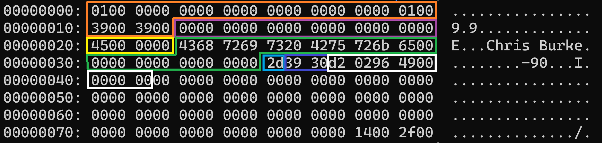

# Fill and Defill

In this section, we're going to update our code to actually insert our new data, and we'll finally be able to test it out by running some insert statements.

Let's pretend we're an insert statement being shuffled along our program's insert code path and make the necessary changes as we find them. Starting at the top, our main function requests input from the user and sends it through the parser. Processing the parse tree is where we come in:

`src/main.c`

```diff
 int main(int argc, char** argv) {
 
 *** code omitted for brevity
 
         break;
       case T_InsertStmt: {
         int32_t person_id = ((InsertStmt*)n)->personId;
         char* name = ((InsertStmt*)n)->name;
+        uint8_t age = ((InsertStmt*)n)->age;
+        int16_t dailySteps = ((InsertStmt*)n)->dailySteps;
+        int64_t distanceFromHome = ((InsertStmt*)n)->distanceFromHome;
-        if (!insert_record(bp, person_id, name)) {
+        if (!insert_record(bp, person_id, name, age, dailySteps, distanceFromHome)) {
           printf("Unable to insert record\n");
         }
         break;
       }
       case T_SelectStmt:
 
 *** code omitted for brevity ***
 
 }
```

We need to extract the new fields from our `InsertStmt` node and pass them to the `insert_record` function. Next we follow the insert path until we get to the `fill_record` and `fill_val` functions.

`src/storage/record.c`

```diff
 static void fill_val(Column* col, char** dataP, Datum datum) {
   int16_t dataLen;
   char* data = *dataP;
 
   switch (col->dataType) {
+    case DT_TINYINT:
+      dataLen = 1;
+      uint8_t valTinyInt = datumGetUInt8(datum);
+      memcpy(data, &valTinyInt, dataLen);
+      break;
+    case DT_SMALLINT:
+      dataLen = 2;
+      int16_t valSmallInt = datumGetInt16(datum);
+      memcpy(data, &valSmallInt, dataLen);
+      break;
     case DT_INT:
       dataLen = 4;
       int32_t valInt = datumGetInt32(datum);
       memcpy(data, &valInt, dataLen);
       break;
+    case DT_BIGINT:
+      dataLen = 8;
+      int64_t valBigInt = datumGetInt64(datum);
+      memcpy(data, &valBigInt, dataLen);
+      break;
     case DT_CHAR:
       dataLen = col->len;
       char* str = strdup(datumGetString(datum));
       int charLen = strlen(str);
       if (charLen > dataLen) charLen = dataLen;
       memcpy(data, str, charLen);
       free(str);
       break;
   }
 
   data += dataLen;
   *dataP = data;
 }
```

We're simply adding more cases to the switch statement to account for the new data types. Make sure you set the `dataLen` to the correct byte size for the data type.

## Datum Conversions

Since we've made several calls to the datum conversion functions for the new data types, we actually need to write them now.

`src/include/storage/datum.h`

```diff
+Datum uint8GetDatum(uint8_t i);
+Datum int16GetDatum(int16_t i);
 Datum int32GetDatum(int32_t i);
+Datum int64GetDatum(int64_t i);
 Datum charGetDatum(char* c);
 
+uint8_t datumGetUInt8(Datum d);
+int16_t datumGetInt16(Datum d);
 int32_t datumGetInt32(Datum d);
+int64_t datumGetInt64(Datum d);
 char* datumGetString(Datum d);
```

`src/storage/datum.c`

```diff
+Datum uint8GetDatum(uint8_t i) {
+  return (Datum) i;
+}
+
+Datum int16GetDatum(int16_t i) {
+  return (Datum) i;
+}
 
 Datum int32GetDatum(int32_t i) {
   return (Datum) i;
 }
 
+Datum int64GetDatum(int64_t i) {
+  return (Datum) i;
+}
 
 Datum charGetDatum(char* c) {
   return (Datum) c;
 }
 
 
+uint8_t datumGetUInt8(Datum d) {
+  return (uint8_t) d;
+}
+
+int16_t datumGetInt16(Datum d) {
+  return (int16_t) d;
+}
 
 int32_t datumGetInt32(Datum d) {
   return (int32_t) d;
 }
 
+int64_t datumGetInt64(Datum d) {
+  return (int64_t) d;
+}
 
 char* datumGetString(Datum d) {
   return (char*) d;
 }
```

## Testing It Out

That's everything we need for insert operations, let's test it out. Make sure you delete the `main.dbd` file before compiling and running the program because any existing data was built on the old table definition.

```bash
$ rm -f db_files/main.dbd
$ make clean && make && ./burkeql
======   BurkeQL Config   ======
= DATA_FILE: /home/burke/source_control/burkeql-db/db_files/main.dbd
= PAGE_SIZE: 128
bql > insert 69 'Chris Burke' 45 12345 1234567890;
======  Node  ======
=  Type: Insert
=  person_id:           69
=  name:                Chris Burke
=  age:                 45
=  daily_steps:         12345
=  distance_from_home:  1234567890
Bytes read: 0
bql > \quit
======  Node  ======
=  Type: SysCmd
=  Cmd: quit
Shutting down...
```

From the node print piece, you can see the values we parsed out of the insert statement. And `\quit` makes sure the data is written to disk. Let's check it out:

`xxd db_files/main.dbd`



The orange and purple boxes are the page header and record header, respectively. Then the yellow and green boxes are the columns we're already used to: `person_id` and `name`. The new ones follow in the order we inserted them.

`age` is the light blue box and represented in hex as 0x2d, which is the same as 45 in decimal. Check.

`daily_steps` is the next two bytes. Remember, my machine is a little endian machine, so the bytes are stored in the opposite order you'd expect. So the actual hex representation of the number is 0x3039, which translates to 12,345 in decimal. Check.

`distance_from_home` is the remaining 8 bytes in the record and is also stored in little endian. So the hex representation is 0x499602d2, which translates to 1,234,567,890.

Everything checks out, right? Wrong. Let's revisit that edge case I mentioned a little while back.

## BigInt Overflow?

You may remember our lexer tokenizes numbers using the `atoi()` function. This will only work for numbers that fit inside a 4-byte int. What happens if we try to insert a number that overflows a 4-byte int, e.g. is greater than 2.1 billion? Let's find out:

```shell
$ make clean && make && ./burkeql
======   BurkeQL Config   ======
= DATA_FILE: /home/burke/source_control/burkeql-db/db_files/main.dbd
= PAGE_SIZE: 128
bql > insert 69 'Chris Burke' 45 12345 12345678900;
======  Node  ======
=  Type: Insert
=  person_id:           69
=  name:                Chris Burke
=  age:                 45
=  daily_steps:         12345
=  distance_from_home:  -539222988
bql > \quit
======  Node  ======
=  Type: SysCmd
=  Cmd: quit
Shutting down...
```

This time I inserted the same data, except for `distance_from_home` I added a zero to the end, making the total 12 billion. Turns out, our code wraps around to the negative regime of the 4-byte number space. Let's fix this.

`src/parser/scan.l`

```diff
--?[0-9]+    { yylval->intval = atoi(yytext); return INTVAL; }
+-?[0-9]+    { yylval->numval = strtoll(yytext, &yytext, 10); return NUMBER; }
```

We changed our converter function to use `strtoll` from the C standard, which can handle up to the `long long` data type. We also changed the names of the tokens defined by bison:

`src/parser/gram.y`

```diff
 %union {
   char* str;
-  int intval;
+  long long numval;
 
   struct Node* node;
   struct ParseList* list;
 }
 
 %parse-param { struct Node** n }
 %param { void* scanner }
 
 %token <str> SYS_CMD STRING IDENT
 
-%token <intval> INTNUM
+%token <numval> NUMBER

*** code omitted for brevity ***

-insert_stmt: INSERT INTNUM STRING INTNUM INTNUM INTNUM  {
+insert_stmt: INSERT NUMBER STRING NUMBER NUMBER NUMBER  {
       InsertStmt* ins = create_node(InsertStmt);
       ins->personId = $2;
       ins->name = str_strip_quotes($3);
       ins->age = $4;
       ins->dailySteps = $5;
       ins->distanceFromHome = $6;
       $$ = (Node*)ins;
     }
   ;
```

Here we just changed `INTNUM` to `NUMBER`.

Now if we run it and try to insert the same large number...

```shell
$ rm -f db_files/main.dbd
$ make clean && make && ./burkeql
======   BurkeQL Config   ======
= DATA_FILE: /home/burke/source_control/burkeql-db/db_files/main.dbd
= PAGE_SIZE: 128
bql > insert 69 'Chris Burke' 45 12345 12345678900;
======  Node  ======
=  Type: Insert
=  person_id:           69
=  name:                Chris Burke
=  age:                 45
=  daily_steps:         12345
=  distance_from_home:  12345678900
Bytes read: 0
bql > \quit
======  Node  ======
=  Type: SysCmd
=  Cmd: quit
Shutting down...
```

We see that the lexer/parser successfully handled the large number.

And that completes the section on `Int`'s. In the next section, we'll add the 1-byte `Bool` data type.