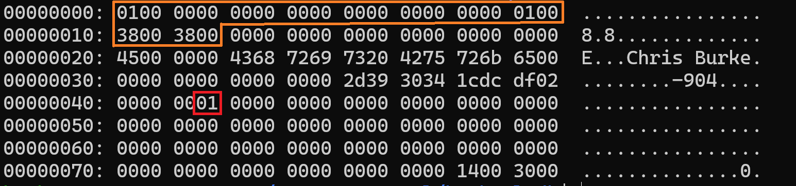

# Fill and Defill

In this section, we're going to update our code to actually insert our new data, and we'll finally be able to test it out by running some insert statements.

Let's pretend we're an insert statement being shuffled along our program's insert code path and make the necessary changes as we find them. Starting at the top, our main function requests input from the user and sends it through the parser. Processing the parse tree is where we come in:

`src/main.c`

```diff
 int main(int argc, char** argv) {
 
 *** code omitted for brevity ***
 
         break;
       case T_InsertStmt: {
         int32_t person_id = ((InsertStmt*)n)->personId;
         char* name = ((InsertStmt*)n)->name;
         uint8_t age = ((InsertStmt*)n)->age;
         int16_t dailySteps = ((InsertStmt*)n)->dailySteps;
         int64_t distanceFromHome = ((InsertStmt*)n)->distanceFromHome;
+        uint8_t isAlive = ((InsertStmt*)n)->isAlive;
-        if (!insert_record(bp, person_id, name, age, dailySteps, distanceFromHome)) {
+        if (!insert_record(bp, person_id, name, age, dailySteps, distanceFromHome, isAlive)) {
           printf("Unable to insert record\n");
         }
         break;
       }
       case T_SelectStmt:
 
 *** code omitted for brevity ***
 }
```

We need to extract the new fields from our `InsertStmt` node and pass them to the `insert_record` function. Next we follow the insert path until we get to the `fill_record` and `fill_val` functions.

`src/storage/record.c`

```diff
 static void fill_val(Column* col, char** dataP, Datum datum) {
   int16_t dataLen;
   char* data = *dataP;
 
   switch (col->dataType) {
+    case DT_BOOL:     // Bools and TinyInts are the same C-type
     case DT_TINYINT:
       dataLen = 1;
       uint8_t valTinyInt = datumGetUInt8(datum);
       memcpy(data, &valTinyInt, dataLen);
       break;
     case DT_SMALLINT:
     
 *** code omitted for brevity ***
 
   }
 
   data += dataLen;
   *dataP = data;
 }
```

Here we can simply piggy-back off of the `DT_TINYINT` logic because they are the same C-type.

## Testing It Out

That's everything we need for insert operations, let's test it out. Make sure you delete the `main.dbd` file before compiling and running the program because any existing data was built on the old table definition.

```shell
$ rm -f db_files/main.dbd
$ make clean && make && ./burkeql
======   BurkeQL Config   ======
= DATA_FILE: /home/burke/source_control/burkeql-db/db_files/main.dbd
= PAGE_SIZE: 128
bql > insert 69 'Chris Burke' 45 12345 12345678900 true;
======  Node  ======
=  Type: Insert
=  person_id:           69
=  name:                Chris Burke
=  age:                 45
=  daily_steps:         12345
=  distance_from_home:  12345678900
=  is_alive:            1
Bytes read: 0
bql > \quit
======  Node  ======
=  Type: SysCmd
=  Cmd: quit
Shutting down...
```

From the node print piece, you can see the values we parsed out of the insert statement. And `\quit` makes sure the data is written to disk. Let's check it out:



The orange box, once again, is the page header. Following it is our record data (same as before), and at the end of the record is our `Bool` column (red box). It's set to 0x01, which translates to True in our DB system.

## Defill

Now, let's refactor the code required for defilling the new data types. The pattern is pretty simple, we just need to add more switch/case branches for the new `DT_BOOL` type.

`src/storage/record.c`

```diff
 static Datum record_get_col_value(Column* col, Record r, int* offset) {
   switch (col->dataType) {
+    case DT_BOOL:     // Bools and TinyInts are the same C-type
     case DT_TINYINT:
       return record_get_tinyint(r, offset);
     case DT_SMALLINT:
       return record_get_smallint(r, offset);
     case DT_INT:
       return record_get_int(r, offset);
     case DT_BIGINT:
       return record_get_bigint(r, offset);
     case DT_CHAR:
       return record_get_char(r, offset, col->len);
     default:
       printf("record_get_col_value() | Unknown data type!\n");
       return (Datum)NULL;
   }
 }
```

This is easy once again because we can piggy-back on the existing `DT_TINYINT` logic. Which is a bonus because we don't need to write a `record_get_bool` function, so... we're done!

In the last section, we'll update the select logic so we're able to output the data to the console.