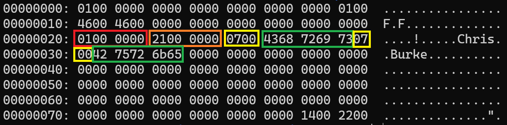
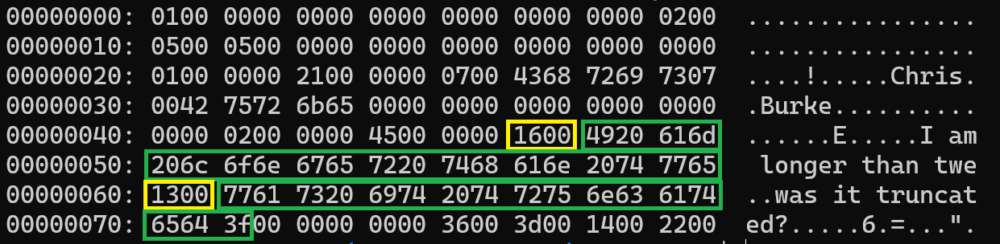

# Inserting Data

Before we can run the program and insert data, we need to make a couple small changes to the parser. Worry not, the changes are pretty small.

## Parser Refactor

`src/include/parser/parsetree.h`

```diff
 typedef struct InsertStmt {
   NodeTag type;
   int32_t personId;
-  char* name;
-  uint8_t age;
-  int16_t dailySteps;
-  int64_t distanceFromHome;
-  uint8_t isAlive;
+  char* firstName;
+  char* lastName;
+  int32_t age;
 } InsertStmt;
```

`src/parser/parsetree.c`

```diff
 static void free_insert_stmt(InsertStmt* ins) {
   if (ins == NULL) return;
 
-  if (ins->name != NULL) free(ins->name);
+  free(ins->firstName);
+  free(ins->lastName);
 }
```

`src/parser/parsetree.c`

```diff
 void print_node(Node* n) {
   if (n == NULL) {
     printf("print_node() | Node is NULL\n");
     return;
   }
 
   printf("======  Node  ======\n");
 
   switch (n->type) {
     case T_SysCmd:
       printf("=  Type: SysCmd\n");
       printf("=  Cmd: %s\n", ((SysCmd*)n)->cmd);
       break;
     case T_InsertStmt:
       printf("=  Type: Insert\n");
       printf("=  person_id:           %d\n", ((InsertStmt*)n)->personId);
-      printf("=  name:                %s\n", ((InsertStmt*)n)->name);
-      printf("=  age:                 %u\n", ((InsertStmt*)n)->age);
-      printf("=  daily_steps:         %d\n", ((InsertStmt*)n)->dailySteps);
-      printf("=  distance_from_home:  %ld\n", ((InsertStmt*)n)->distanceFromHome);
-      printf("=  is_alive:            %u\n", ((InsertStmt*)n)->isAlive);
+      printf("=  first_name:          %s\n", ((InsertStmt*)n)->firstName);
+      printf("=  last_name:           %s\n", ((InsertStmt*)n)->lastName);
+      printf("=  age:                 %d\n", ((InsertStmt*)n)->age);
       break;
     case T_SelectStmt:
       print_selectstmt((SelectStmt*)n);
       break;
     default:
       printf("print_node() | unknown node type\n");
   }
 }
```

`src/parser/gram.y`

```diff
-insert_stmt: INSERT NUMBER STRING NUMBER NUMBER NUMBER bool {
+insert_stmt: INSERT NUMBER STRING STRING NUMBER  {
       InsertStmt* ins = create_node(InsertStmt);
       ins->personId = $2;
-      ins->name = str_strip_quotes($3);
-      ins->age = $4;
-      ins->dailySteps = $5;
-      ins->distanceFromHome = $6;
-      ins->isAlive = $7;
+      ins->firstName = str_strip_quotes($3);
+      ins->lastName = str_strip_quotes($4);
+      ins->age = $5;
       $$ = (Node*)ins;
     }
   ;
```

All of the above changes are simply there to reflect the new table definition we're working with.

## Insert Data

We're now at the point where we can insert data and inspect the contents of the data page. Let's dive right in (remember to delete your old data file first):

```shell
$ rm -f db_files/main.dbd
$ make clean && make && ./burkeql
======   BurkeQL Config   ======
= DATA_FILE: /home/burke/source_control/burkeql-db/db_files/main.dbd
= PAGE_SIZE: 128
bql > insert 1 'Chris' 'Burke' 33;
======  Node  ======
=  Type: Insert
=  person_id:           1
=  first_name:          Chris
=  last_name:           Burke
=  age:                 33
Bytes read: 0
bql > \quit
======  Node  ======
=  Type: SysCmd
=  Cmd: quit
Shutting down...
```

Here I insert:

| person_id | first_name | last_name | age |
| 1 | Chris | Burke | 33 |

Let's check out the contents of the page:

Using the command `xxd db_files/main.dbd`



Since we already know about the page header, record header, and slot pointers I am not highlighting those sections. Instead, let's focus on the interesting stuff.

The red box is our `person_id` column - set to 1 as expected.

The orange box is our `age` column - set to 33 as expected (21 in hex translates to 33 in decimal). We can see our storage engine successfully stored the `age` data before the varchar columns despite `age` being the last column in the table definition.

Next we have the two varchar columns. The yellow boxes are the 2-byte length fields - both set to 7. And following that are the column data themselves (green boxes).

Let's insert another record.

```shell
$ ./burkeql
======   BurkeQL Config   ======
= DATA_FILE: /home/burke/source_control/burkeql-db/db_files/main.dbd
= PAGE_SIZE: 128
bql > insert 2 'I am longer than twenty characters' 'was it truncated?' 69;
======  Node  ======
=  Type: Insert
=  person_id:           2
=  first_name:          I am longer than twenty characters
=  last_name:           was it truncated?
=  age:                 69
bql > \quit
======  Node  ======
=  Type: SysCmd
=  Cmd: quit
Shutting down...
```

This time, I tried to insert text that exceeds the 20-character limit of the `Varchar` column. Let's see what our storage engine wrote to disk:



Just highlighting our varchar columns, you can see the text representation on the right side and that yes our long column was indeed truncated.