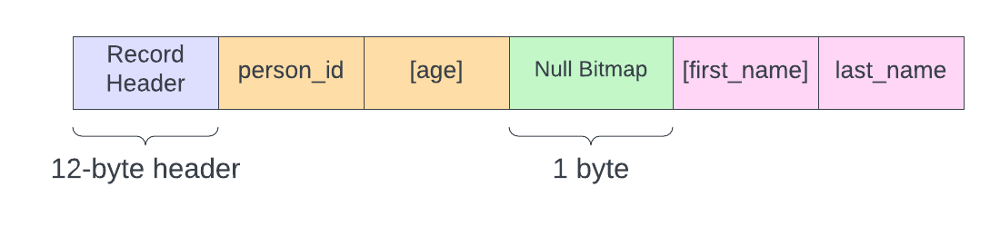

# Null Constraints

Null data is an extremely important feature of relational databases. Sometimes an entity doesn't have any data to store for a given field. For example, you might have a table that stores data for sporting events. And in that table there would be columns for `start_date` and `end_date` that store the exact times the event started and ended. While the event is in progress, the `end_date` field would necessarily be `Null`.

Since `Null` literally means "nothing", we will need a mechanism to store "nothing" in a way that doesn't interfere with the storage engine's ability to read data from a record. In our current implementation, we take advantage of strictly-defined data lengths while stepping through a record and reading data. If any given field were missing, it would throw off all subsequent reads in that record. So we need the ability to signify to the storage engine that a certain field exists or not.

Enter: the null bitmap.

## Null Bitmap

The Null bitmap is exactly that, a bitmap indicating whether a given column is Null or not. It lives in the boundary between the fixed-length and variable-length columns, BUT it is only present when the table has nullable columns. If a table is defined such that all columns are `Not Null`, then the storage engine does not waste space on a Null bitmap because it would be redundant.

Moreover, the order of bits in the null bitmap correspond to the physical order of columns stored in the record. Meaning, all fixed-length columns are represented first, followed by all variable-length columns.

Now let's consider the table we're going to work with and look at the physical structure of a record in that table. Our table is defined as:

```sql
Create Table person (
    person_id Int Not Null,
    first_name Varchar(20) Null,
    last_name Varchar(20) Not Null,
    age Int Null
);
```

We have two fixed-length columns and two variable-length columns; one column of each is nullable. The physical structure will look like:



We have the ever-present 12-byte record header to start us off, then our fixed-length columns `person_id` and `age`. Followed by our 1-byte null bitmap, then our variable-length columns `first_name` and `last_name`.